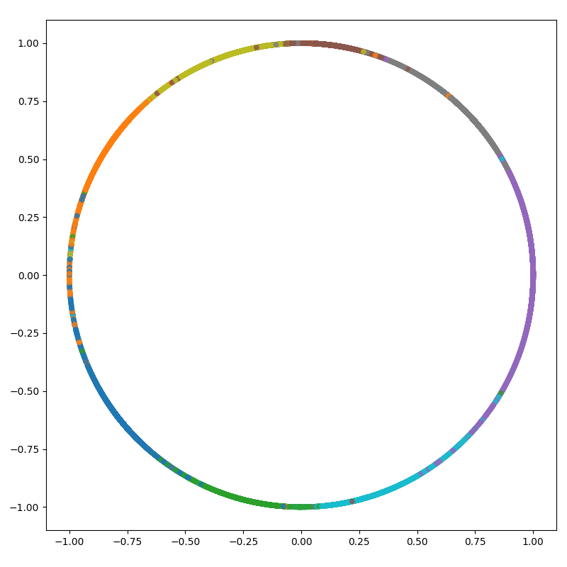
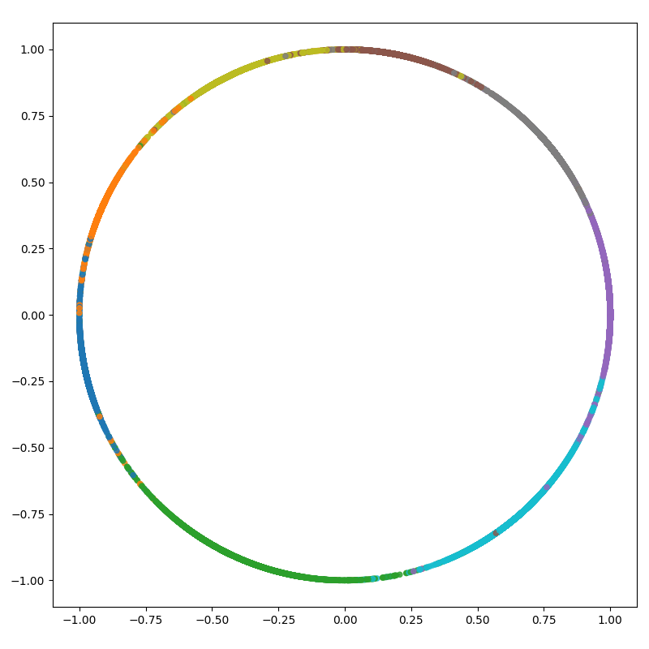
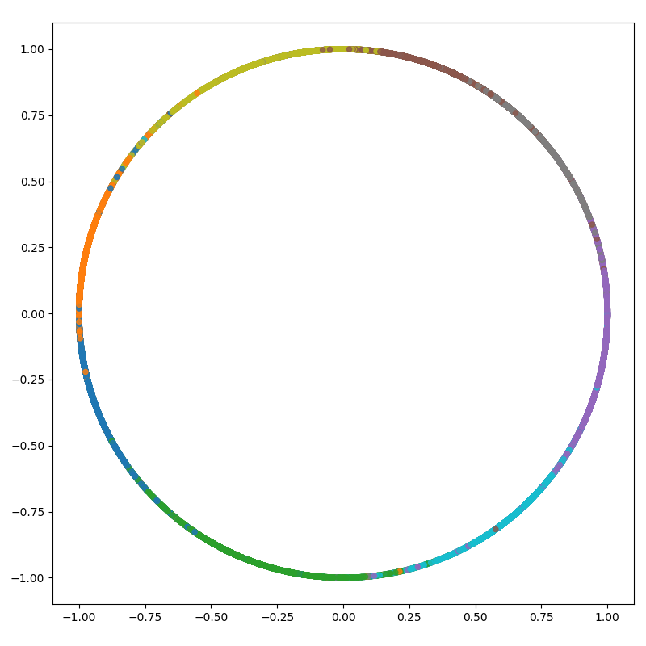
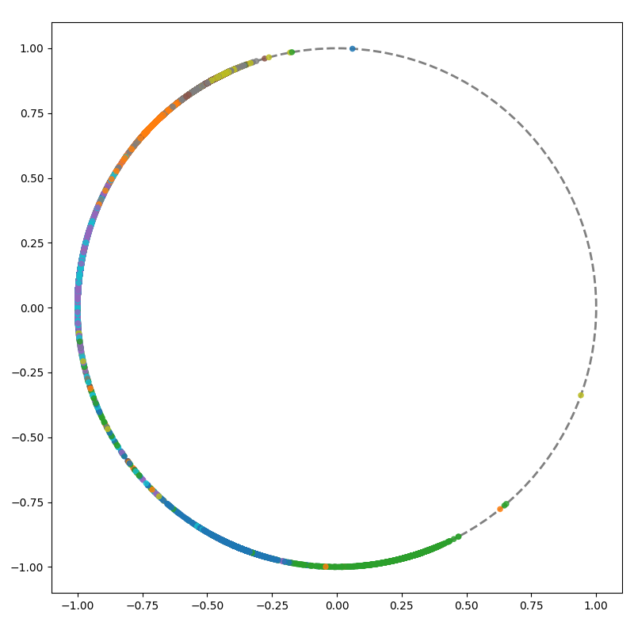

# Arcmargin Losses

This repository is meant to compare the different margin-based loss functions
[ArcFace](https://www.doi.org/10.1109/CVPR.2019.00482),
[CosFace](https://www.doi.org/10.1109/CVPR.2018.00552) and
[SphereFace](https://www.doi.org/10.1109/CVPR.2017.713).

All three loss functions can be described in a united framework with the following formula:

$$
(\cos(m_1 \theta + m_2) - m_3)
$$

where

- $m_1$ is the *multiplicative angular margin* introduced in SphereFace
- $m_2$ is the *additive angular margin* introduced in ArcFace
- $m_3$ is the *additive cosine margin* introduced in CosFace

This repository is inspired by <https://github.com/cvqluu/Angular-Penalty-Softmax-Losses-Pytorch>.

## Setup

We recommend [miniforge](https://conda-forge.org/download/) to set up your python environment.
In case VSCode does not detect your conda environments, install [nb_conda](https://github.com/conda-forge/nb_conda-feedstock) in the base environment.

```bash
conda env create -n $YOUR_ENV_NAME -f environment.yml
conda activate $YOUR_ENV_NAME
pip install -r requirements.txt
pre-commit install
```

## Training

You can train the model with different headers (linear, arcface, cosface, sphereface) like so:

```bash
python train.py --pl_module.header $HEADER_NAME
```

## Evaluation

To generate predictions and to visualize the embeddings run:

```bash
python eval.py --header $HEADER_NAME
```

## Results

Currently, our results for training and evaluating on the MNIST dataset with a 2-dimensional embedding vector look as follows:

- Linear Header:

    <div style="text-align: left;">
        
    </div>

- ArcFace Header:

    <div style="text-align: left;">
        
    </div>

- CosFace Header:

    <div style="text-align: left;">
        
    </div>

- SphereFace Header:

    <div style="text-align: left;">
        
    </div>

## Todos

- [ ] The margin for ArcFace and CosFace should be better visible compared to the Linear Header
- [ ] Fix SphereFace such that the embeddings are also fully distributed on the unit circle
- [ ] Add interactive 3D visualizations to visualize 3-dimensional embedding vectors
