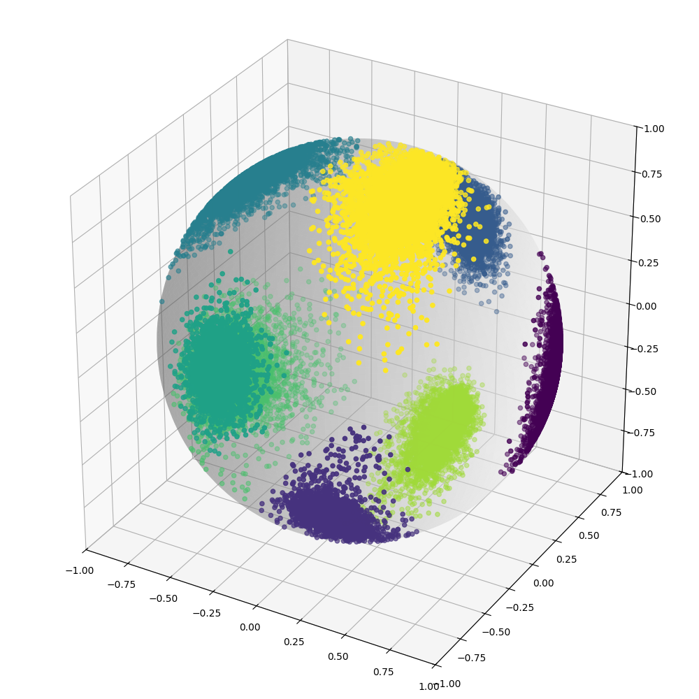
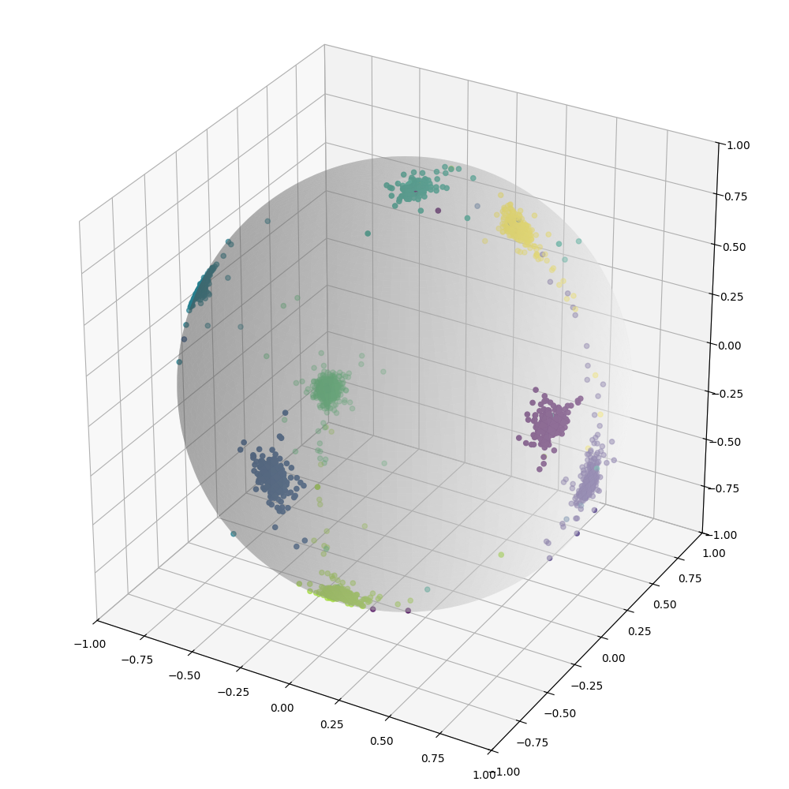
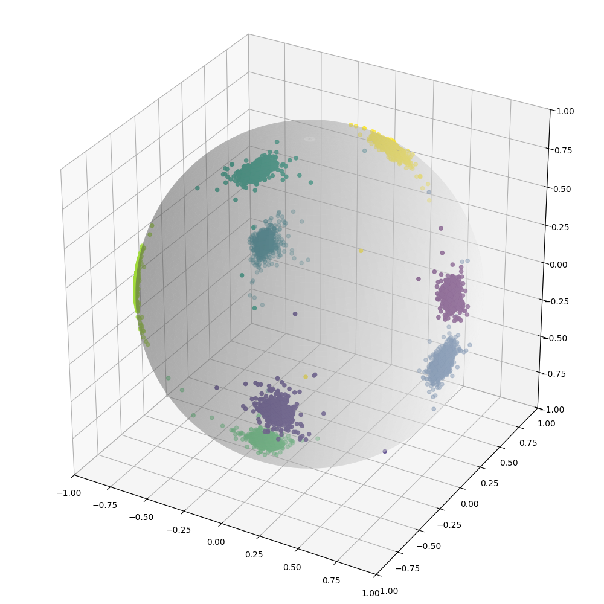
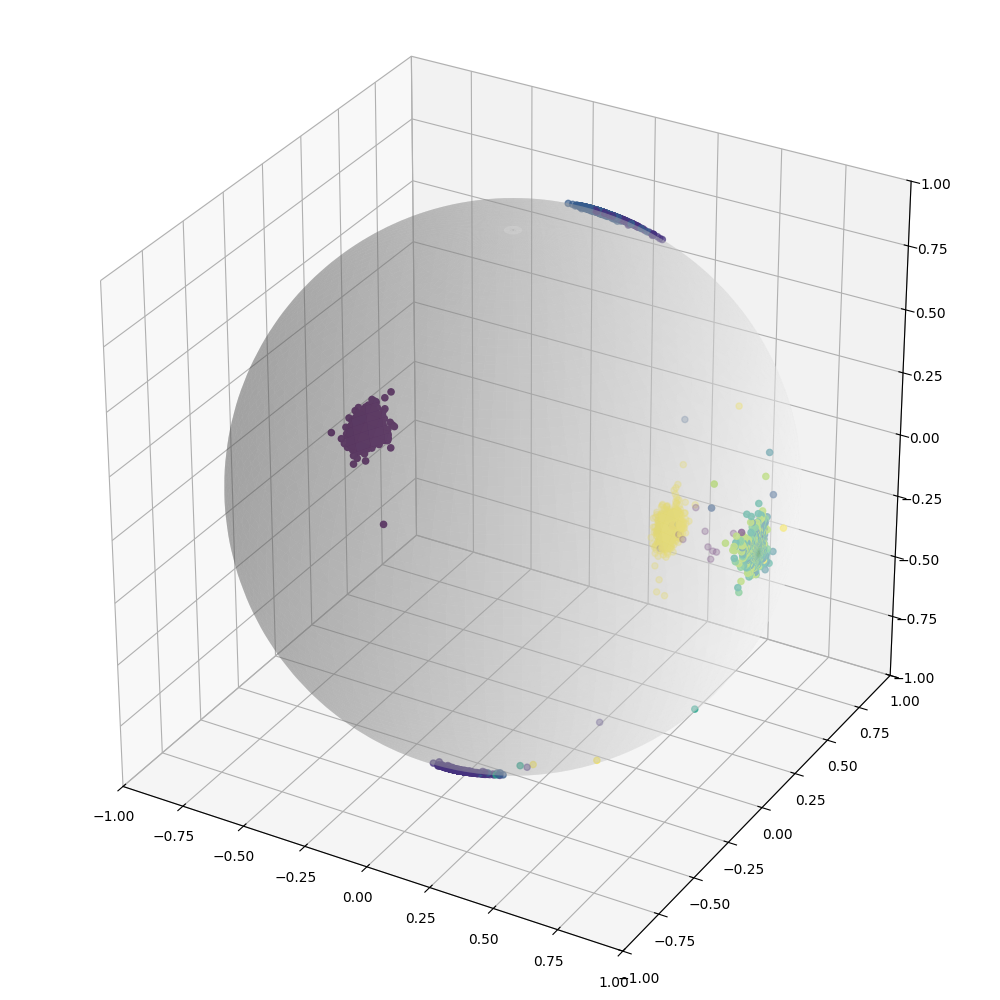

# Arcmargin Losses

This repository is meant to compare the different margin-based loss functions
[ArcFace](https://www.doi.org/10.1109/CVPR.2019.00482),
[CosFace](https://www.doi.org/10.1109/CVPR.2018.00552) and
[SphereFace](https://www.doi.org/10.1109/CVPR.2017.713).

All three loss functions can be described in a united framework with the following formula:

$$
(\cos(m_1 \theta + m_2) - m_3)
$$

where

- $m_1$ is the *multiplicative angular margin* introduced in SphereFace
- $m_2$ is the *additive angular margin* introduced in ArcFace
- $m_3$ is the *additive cosine margin* introduced in CosFace

This repository is inspired by <https://github.com/cvqluu/Angular-Penalty-Softmax-Losses-Pytorch>.

## Setup

We recommend [miniforge](https://conda-forge.org/download/) to set up your python environment.
Then [uv](https://docs.astral.sh/uv/) can be used to install the requirements from `requirements.txt`.

```bash
conda create -n $YOUR_ENV_NAME python=3.12
conda activate $YOUR_ENV_NAME
uv pip install -r requirements.txt
pre-commit install
```

## Training

You can train the model with different headers (linear, arcface, cosface, sphereface) like so:

```bash
python train.py --pl_module.header $HEADER_NAME
```

## Evaluation

To generate predictions and to visualize the embeddings run:

```bash
python eval.py --header $HEADER_NAME
```

## Results

Our results for training and evaluating on the MNIST dataset with a 3-dimensional embedding vector look as follows. We also provide the corresponding training configs for reproducibility.

- Linear Header:

    <div style="text-align: left;">
        
    </div>

    Config: [configs/linear.yaml](/configs/linear.yaml)

- ArcFace Header:

    <div style="text-align: left;">
        
    </div>

    Config: [configs/arcface.yaml](/configs/arcface.yaml)

- CosFace Header:

    <div style="text-align: left;">
        
    </div>

    Config: [configs/cosface.yaml](/configs/cosface.yaml)

- SphereFace Header:

    <div style="text-align: left;">
        
    </div>

## Observations

The training with the margin-based losses is quite sensitive to choosing an appropriate combination of batch-size and learning-rate.

## Todos

- [ ] Find a working configuration for SphereFace
- [ ] Find a working parameter set for training on Cifar-10
